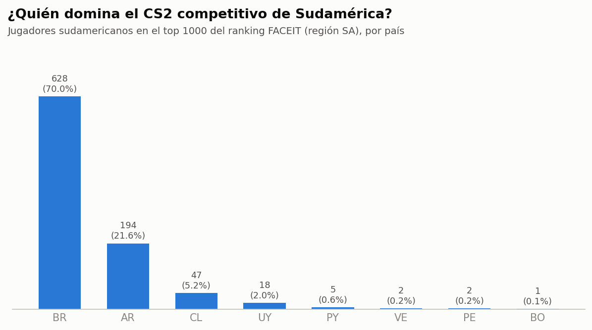
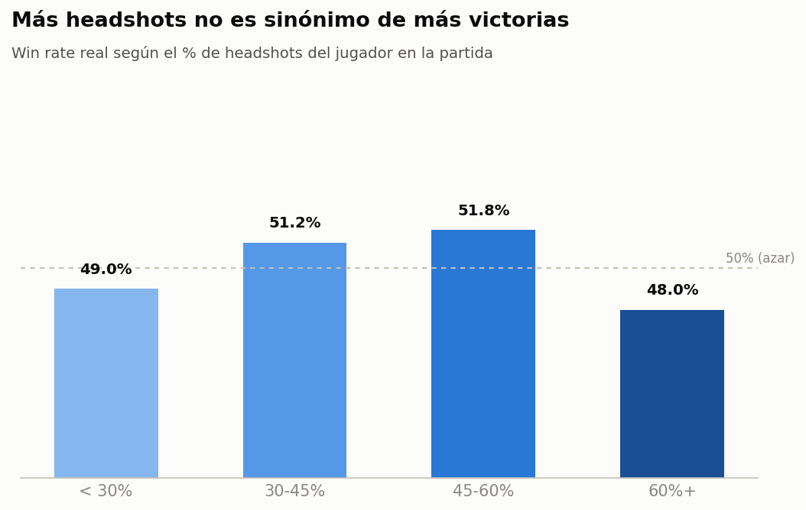
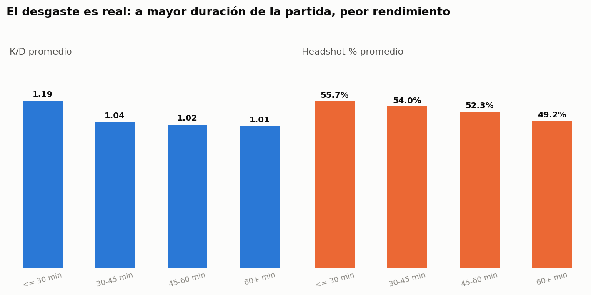

# CS2 Sudamérica — Analytics

Radiografía del CS2 competitivo en Sudamérica: de dónde salen los mejores jugadores de la región, qué mapas son más parejos, si el aim solo alcanza para ganar, y si el desgaste de partidas largas se nota en los números. Todo con datos reales extraídos directamente de la API de FACEIT — no un dataset armado de Kaggle.

## Hallazgos

### 1. Brasil concentra 7 de cada 10 jugadores top de la región

Sobre los jugadores sudamericanos que entran al top 1000 del ranking de FACEIT en la región SA, Brasil se lleva el 70%. Argentina es el único otro país con presencia real (21.6%); Colombia y Ecuador no meten a nadie en el top 1000.



### 2. El headshot % no predice quién gana

Los que ganan una partida tienen bastantes más kills que los que pierden (16.8 vs 13.8 en promedio) — hasta ahí, nada raro. Pero el % de headshots es prácticamente igual entre ganadores y perdedores, y el grupo con MÁS headshots (60%+) tiene la win rate más baja de los cuatro grupos. El aim solo no gana partidas de CS2 en Sudamérica.



### 3. El desgaste por partidas largas es real

Comparando el rendimiento según la duración real de la partida: el K/D promedio cae de 1.19 en partidas cortas (≤30 min) a 1.01 en partidas de más de una hora, y el headshot % cae de 55.7% a 49.2%. La caída es consistente en ambas métricas — hay desgaste real, no es ruido.



### 4. Un nombre reconocible entre los "jugadores revelación"

Cruzando el ELO actual de cada jugador contra su rendimiento real en las partidas analizadas, apareció **coldzera** — el histórico jugador profesional brasileño — con un ELO relativamente bajo para su nivel real pero un K/D de 1.95 y 100% de percentil de rendimiento en la muestra. Setup completo en [`sql/04_jugadores_revelacion.sql`](./sql/04_jugadores_revelacion.sql).

### 5. Rachas: 13 victorias seguidas

El jugador con la racha activa más larga del top de la región lleva 13 partidas ganadas consecutivas. Calculado con `LAG()` y el patrón "gaps and islands" — ver [`sql/05_rachas_y_momentum.sql`](./sql/05_rachas_y_momentum.sql).

### 6. `de_cache` es el mapa más parejo de la región

Entre los mapas con muestra suficiente (20+ partidas), `de_cache` tiene la menor diferencia de rondas promedio (4.99), es decir, las partidas ahí terminan más ajustadas que en el resto del pool competitivo.

## Cómo se armó

Los datos se extrajeron con [`fetch_faceit_data.py`](./fetch_faceit_data.py) contra la [Data API v4 de FACEIT](https://docs.faceit.com/docs/data-api/), con una API key propia gratuita del [Developer Portal](https://developers.faceit.com/). El pipeline:

1. Baja el ranking completo (top 1000) de la región **SA** de CS2, paginado.
2. Para esos 1000, suma sus stats de por vida (partidas, win rate, K/D, HS%).
3. Para el top 150 (los de mayor nivel), baja el historial de sus últimas 30 partidas.
4. Para cada partida única de ese grupo, baja el detalle por jugador/mapa y la duración real de la partida.

La API key nunca se hardcodea — se lee de la variable de entorno `FACEIT_API_KEY`.

### Aclaración sobre "Sudamérica"

La región **SA** de FACEIT es la cola de *servidores*, no una garantía de nacionalidad — aparece gente de otras partes del mundo que juega ahí. Para el análisis regional se filtra por los países sudamericanos reales (`is_sa_country = 1` en la tabla `players`); el resto queda como dato de contexto.

### Notas de calidad de datos

- 8 partidas de torneos/ligas organizadas (no de la cola pública) no tienen duración real registrada por la API — quedan marcadas con `has_valid_duration = 0` y excluidas del análisis de desgaste.
- El detalle de partidas se bajó solo para el top 150 jugadores (no los 1000), para mantener la corrida del pipeline en un tiempo razonable.

## Estructura del repo

```
cs2-sudamerica-analytics/
├── fetch_faceit_data.py       # extractor: FACEIT API -> CSVs crudos
├── build_database.py          # limpieza + carga a SQLite
├── make_charts.py             # genera los gráficos de este README
├── data/
│   ├── raw/                   # CSVs crudos (salida del extractor)
│   └── processed/cs2_sa.db    # base SQLite lista para consultar
├── sql/                       # una query por hallazgo, comentada
└── charts/                    # gráficos del README
```

## Cómo correrlo

```bash
pip install -r requirements.txt

# 1. Extraer datos (necesita tu propia API key de FACEIT)
export FACEIT_API_KEY="tu-key-aca"
python fetch_faceit_data.py

# 2. Limpiar y cargar a SQLite
python build_database.py

# 3. Regenerar los gráficos
python make_charts.py

# 4. Explorar las queries
sqlite3 data/processed/cs2_sa.db < sql/01_dominancia_por_pais.sql
```

## Stack

Python (extracción y limpieza) · SQLite · SQL (análisis) · Matplotlib (gráficos) · [FACEIT Data API v4](https://docs.faceit.com/docs/data-api/)
