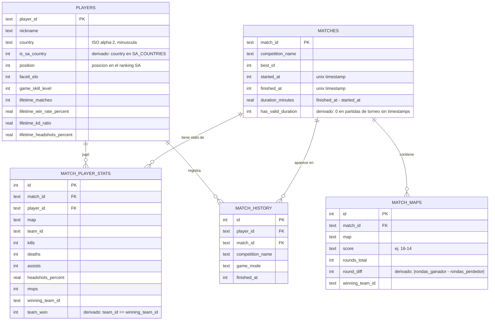

# Modelo de datos — `cs2_sa.db`

Diagrama entidad-relación de la base SQLite armada en [`build_database.py`](../build_database.py) a partir de los CSVs crudos que baja [`fetch_faceit_data.py`](../fetch_faceit_data.py). GitHub renderiza el diagrama automáticamente (es Mermaid, no una imagen).

## Notas del modelo

- **`players`** son los 1000 jugadores del top del ranking SA. `is_sa_country` distingue jugadores realmente sudamericanos de gente que juega en los servidores SA pero es de otra región (ver aclaración en el [README](../README.md)).
- **`matches`** y **`match_maps`** están a nivel partida y a nivel mapa por separado porque una partida BO3 tiene hasta 3 mapas — `match_maps` es 1:N respecto a `matches`.
- **`match_player_stats`** es la tabla más granular (24.301 filas): una fila por jugador y por mapa. Acá vive casi todo el análisis de rendimiento.
- **`match_history`** solo registra qué partidas jugó cada jugador (útil para reconstruir el orden temporal); el detalle de cada partida vive en las otras tres tablas.
- El detalle completo (`match_maps`, `match_player_stats`) solo se bajó para el **top 150** jugadores por posición en el ranking, no para los 1000 — así el pipeline corre en un tiempo razonable contra los rate limits de la API. `players` y `match_history` sí cubren, cada una, su alcance completo (1000 y top 150 respectivamente).
